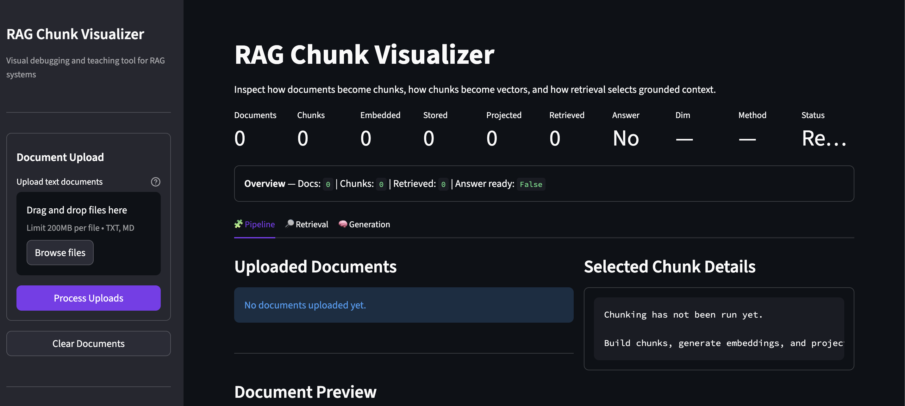
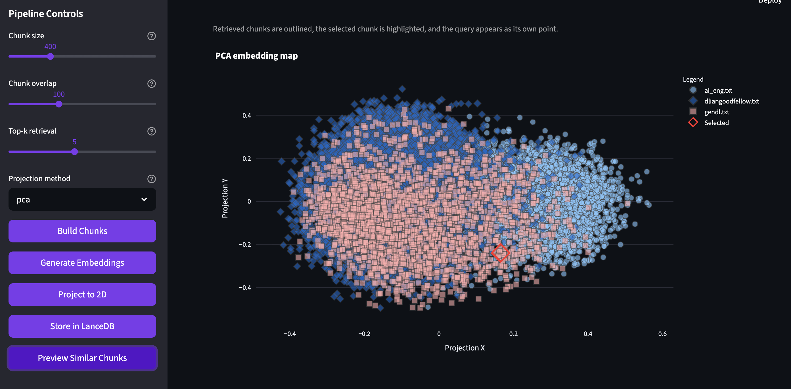
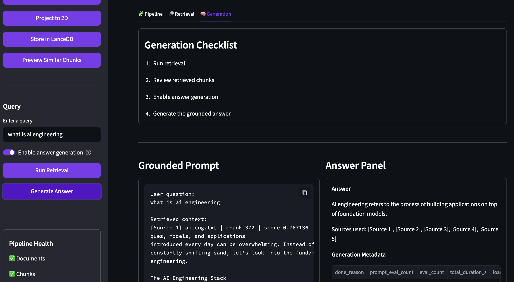
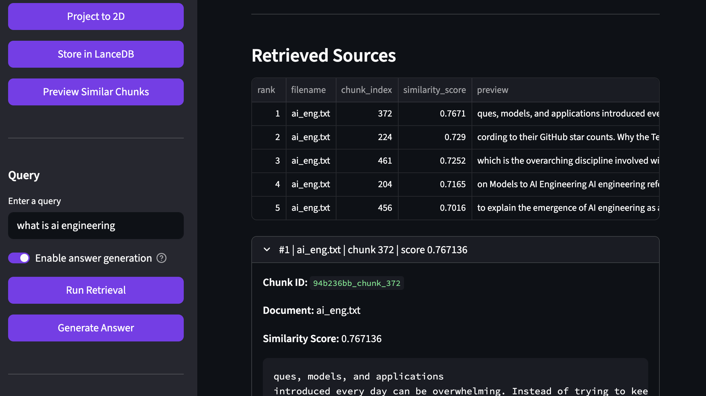

# RAG Chunk Visualizer

> An interactive app that makes retrieval augmented generation (RAG) visible.

This project helps users **see and debug how RAG works internally** by visualizing:

- document chunking
- chunk embeddings
- 2D embedding space
- nearest-neighbor retrieval
- query-to-chunk similarity
- prompt construction
- answer generation

## GUI Preview

### Home


### Emedding Map


### Query Retrieval


### Grounded answer generation



## Repo structure
```
rag-chunk-visualizer/
├── data/
│   ├── documents/
│   ├── exports/
│   └── lancedb/
├── docs/
│   ├── demo_script.md
│   ├── interview_talking_points.md
│   └── images/
├── scripts/
│   └── smoke_check.py
├── src/rag_chunk_visualizer/
│   ├── app/
│   │   ├── layout.py
│   │   └── state.py
│   ├── core/
│   │   ├── config.py
│   │   └── logging.py
│   ├── models/
│   │   ├── chunk.py
│   │   └── document.py
│   ├── services/
│   │   ├── chunking_service.py
│   │   ├── document_service.py
│   │   ├── embedding_service.py
│   │   ├── rag_service.py
│   │   └── retrieval_service.py
│   ├── storage/
│   │   └── lancedb_store.py
│   └── visualization/
│       ├── plotting.py
│       └── projection.py
├── tests/
├── streamlit_app.py
├── pyproject.toml
└── README.md
```
## Setup
### 1. Create and Setup env
```bash
python3 -m venv .venv
source .venv/bin/activate
python -m pip install --upgrade pip
python -m pip install -e ".[dev]"
```

### 2. Pull and run ollama model
```bash
ollama pull llama3.2:3b
```
Make sure ollama is installed locally and is running

### 3. Run Checks
```bash
ruff check .
pytest -q
python scripts/smoke_check.py
```

### 4. Start the app
```bash
python -m streamlit run streamlit_app.py
```

### Linting and formatting
```bash
ruff check . --fix
ruff format .
ruff check .
```

### run tests
```bash
pytest -q
```

